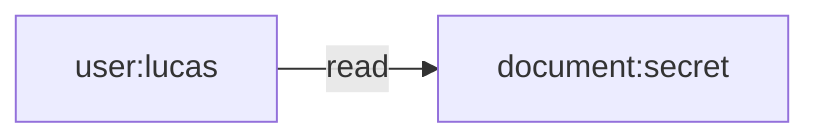

# kube-rebac-authorizer

Welcome to a prototype of how to integrate Kubernetes Authorization with Relation-Based Access Control (ReBAC)!

The core idea is that this project provides an Authorizer implementation that the Kubernetes API server can webhook to, replacing the need for both the RBAC authorizer and Node authorizer, deployed in practically all Kubernetes clusters, while offering a wider, general-purpose, way to write authorization rules for your Kubernetes cluster or [kcp-like][kcp] generic control planes.

The work in this repository is described and core idea is proposed in a [Cloud Native Rejekts talk][rejekts-talk] from November 5, 2023.

I highly recommend **watching this talk before** reading the rest of the README: **https://www.youtube.com/live/tWWBzsZLrIw?t=396**

I also highly recommend checking out the talk presentation: https://speakerdeck.com/luxas/beyond-rbac-implementing-relation-based-access-control-for-kubernetes-with-openfga

## :star: Features

- **Intuitive Integration with non-Kubernetes sources:** Utilizing the policy data that you have specified in Kubernetes is great, but sometimes you have other sources of data affecting the authorization state, such as user groups in LDAP/GitHub/etc., cloud IAM roles, or team permissions in your own system's databases, all of which "speak different languages" when it comes to authorization. Using ReBAC, you now have a **"lingua franca"** for which you can one-way sync (project, map, reconcile) all your other authoritative permission and user data from the ReBAC graph data model, and make authorization decisions based on relations, without having to move the data from their "native places".
- **Natively-supported Deny Roles:** The Kubernetes authorizer framework itself supports denying specific requests, but RBAC is only additive. With the ReBAC approach, we can natively and intuitively integrate deny roles.
- **Superset of RBAC:** Everything you can do with RBAC today, you can do with ReBAC! This Authorizer is also compatible with [Kubernetes RBAC types][kube-docs-rbac]. However, you can also do much more than with plain RBAC.
- **Inheritance**: You can now specify, for example, that if a user can access a given API object in the Kubernetes API (e.g., a `Deployment`), then it can also access all the child `ReplicaSet`s and grandchild `Pod`s without having to grant access the user access to list all `ReplicaSet`s or `Pod`s. Now, this specific Deployment-ReplicaSet-Pod example is perhaps not very useful in practice, but what is, for example, is to grant a user or controller only access to such `Secret`s that given, say `Ingress` or `Gateway`, objects reference, and not all `Secrets` cluster-wide (a really serious privilege if the used credential is compromised, or for [confused deputy scenarios][wikipedia-confused-deputy]).


[kcp]: <https://www.kcp.io/>
[rejekts-talk]: <https://cfp.cloud-native.rejekts.io/cloud-native-rejekts-na-chicago-2023/talk/JVPXE3/>
[kube-docs-rbac]: <https://kubernetes.io/docs/reference/access-authn-authz/rbac/>
[sig-auth]: <https://github.com/kubernetes/community/tree/master/sig-auth>
[openfga]: <https://openfga.dev/>
[zanzibar-paper]: <https://research.google/pubs/pub48190/>
[wikipedia-confused-deputy]: <https://en.wikipedia.org/wiki/Confused_deputy_problem>
[roles-explosion]: <https://knight.segfaults.net/papers/20100502%20-%20Aaron%20Elliott%20-%20WOLRDCOMP%202010%20Paper.pdf>

> :handshake: **IMPORTANT:** While this project demonstrates a re-implementation of the RBAC and Node authorizers in Kubernetes, the aim is not to make those obsolete in any way. The aim is to demonstrate how the concepts relate, showcase that ReBAC can offer what we already have, and more, as well as experiment with making Kubernetes' (in-core and out-of-core) authorization primitives even better in the future.

> :warning: **WARNING:** This is a prototype which, although close, is **not** (at the time of writing) 100% feature-compatible with neither the RBAC nor the Node authorizer, and this project is **not in any way production-ready**. Use it at your own risk.

## Looking for feedback!

The goal here is to discuss in the Cloud Native / Kubernetes community how we can apply the great recent developments of open source ReBAC projects.

:rocket: Get in touch! I'm looking for feedback on the approach. I'm planning to bring this to the [Kubernetes Special Interest Group for Authorization][sig-auth] soon.

You can open an issue, star :star: this repo so I see your interest, or reach out to me on Twitter (I'm [@kubernetesonarm](https://twitter.com/kubernetesonarm/)) or the CNCF or Kubernetes Slacks (I'm @luxas). Looking forward to speak with you!

## What is Relation Based Access Control?

ReBAC is an evolution of Role-Based Access Control and Attribute-Based Access Control, and was popularized by the [Google Zanzibar paper][zanzibar-paper]. The core idea is that the authorization state (who X can do Y on resource Z) is modelled as a graph with **nodes** (for example, users and documents) and **relations** (directed edges) between them (user named `lucas` is related to document `secret` through the relation `read`).



A ReBAC service, such as the CNCF project [OpenFGA][openfga] used here, provides an API to read and write what the authorization state looks like (what nodes and edges there are), define a schema/model for _how_ the graph can be constructed, and for querying the graph (e.g., **does** this user node have access to this document node? or **what** documents does this user have access to through this relation?).

ReBAC can be an effective tool in combating the [Roles Explosion][roles-explosion] phenomenon often seen in RBAC setups, which practically limits the usefulness of RBAC deployments, although in theory it would be possible to specify more fine-grained RBAC definitions than is practical. In order to understand the true usefulness of ReBAC, however, let's dive into how the authorization state is specified!

### Authorization Model

Each node and relation has specific type, e.g., a node representing a user named lucas could be named `user:lucas` where `user` is the node type, and `lucas` is the node identifier. Furthermore, a node of a certain type can be related to nodes of other types through specific types of relations (e.g., `read`, `write`, `admin`, and so forth), as described by the **authorization model**. You can think of the authorization model as schema validation (e.g., OpenAPI / JSON Schemas) for the graph, defining what can relate to what and how.

TODO: Insert picture from the slides on the type model.

#### Definition Schema (Tuples)

The graph describing the authorization state is made up by a list of **Tuples**.
A Tuple describes a direct edge in the graph of the form `{source_node, relation, destination_node}`. The source node is often referred to as the **subject node** or **user node** of the tuple, and the destination node the **object node**.

> Note: The fact that relations have a direction means that even though `user:lucas` is related to `document:secret` through the `access` relation, there is no way for anyone related to `document:secret` to traverse towards the `user:lucas` node (unless another relation from document to user is added, of course). This has direct implications for parent-child relationships: if you want to model that someone with access to a parent (e.g., something general) should be able to access child nodes as well (something specific), then you create a relation from the parent to the child, but another relation from child to parent is needed if you want to model that people with access to the child (e.g., something specific) should also get access to the parent (that is more general).

There are two types of ways to specify the subject node(s) of a Tuple:

- Direct Node Assignment: The straightforward case, e.g., `user:lucas` is related to `document:secret` through the `access` relation.
- UserSet through Relation Assignment: This matches a _set of subject nodes_ to bind the tuple to, and is a powerful way to describe more advanced, propagating relationships. For example, given:
    - a Tuple from `user:alice` to `folder:clients` through the `owner` relation,
    - a Tuple from `user:bob` to `folder:clients` through the `owner` relation,
    - we can create a Tuple from `folder:clients#owner` to `document:customercase` through the `editor` relation. Notable here is that the UserSet `folder:clients#viewer` will resolve both to `user:alice` and `user:bob` without ever creating direct edges between `user`s and `document`s. The power of the graphs becomes unlocked!

#### Evaluation Schema (Rewrites)

Although UserSets are powerful, as seen above, sometimes they are not quite enough. With the most recent example, we could say that a set of users can relate to one document through a certain relation. But if we want to give the owners of the clients folder (`folder:clients#owner`) access to another document, say `document:marketingplan`, we would need another Tuple as follows: `{folder:clients#owner, editor, document:marketingplan}`. This needs to be done, as otherwise we don't know which documents belong to which folders. However, this gets tedious quickly.

The solution to this is to define rules, rewrites, of the defined tuple data, that are computed at evaluation (query) time, e.g., when issuing a `Check` request asking "is this subject node related to this object node through this relation", or in more simple terms "can this actor perform this action on this object?"

We'd like to just define relations between `user`s and `folder`s, and `folder`s and `document`s, and then dynamically resolve the (possibly recursive) relations between user -> folder -> document. We can do this by specifying simple `{user:alice, owner, folder:clients}` and `{folder:clients, contains, document:customercase}`-like tuples, and defining rules for how the ReBAC engine shall resolve (or rewrite) these edges. Notably, at this point, there is no relation between `user` and `document` nodes at all (only between `user` and `folder`, and `folder` and `document`).

The Zanzibar paper proposes several rewrites, of which one is the **Tuple to UserSet** rewrite. With the most recent example, we could define a rule on the `document` type, which says that "any subject node that is an `owner` of a `folder` node that I am connected with through the `contains` relation, will be related to me as `editor`". In this case, the rewrite creates a path between `user` and `document` nodes. The name comes from that, in this case, the `{folder:clients, contains, document:customercase}` Tuple with subject type `folder` is traversed "backwards" (or forwards, depending on how you think about it), in order to yield a UserSet of the subject types of the `owner` relation (here, `user`).

There are other rewrites available as well, but surprisingly few at the end of the day, given that Google is using it for authorization in all of their services **TODO link**. The other ones are:

- Computed UserSets: Recall that a UserSet represents a set of subject nodes that are bound to a given node through a given relation. Let's say `user:alice` and `user:bob` are bound to `folder:clients` as `owners`. Now, if we want to define another relation, `viewer`, for folders, it would be tedious (and error-prone) to specify that, indeed, `user:alice` and `user:bob` are bound to `folder:clients` as `viewer` too, as it is expected in the client application that owners indeed can view. However, consistency issues could arise if there are two or more Tuples, where some tuples are "derived" and need to be atomically created or deleted when the "defining" tuple is. In this case, we can assign the computed UserSet `owners` on `folder` to the `viewer` relation on `folder`. So whenever the ReBAC engine evaluates who is bound to the `viewer` relation, all subject nodes of the `owners` relation are added to the search.
- Set operations: Union (`or`), Intersection (`and`), and Exclusion (`not`) operations can be applied to UserSets at evaluation time.

## Kubernetes Authorization Model

### Kubernetes API server

The Kubernetes API server is an extensible, uniform, and declarative REST API server. Let's look at the implications of this:

- **Declarative:** The user-declared desired "end state" of the system is stored, not just actions for the user to invoke to reach some end state. For example, instead of exposing a `POST /resource/start` method, which would be imperative, the API server lets the user `POST` or `PUT /resource` with a body of `{"spec":{"shouldBeRunning": true}}`, where, by convention, the `spec` object contains the user-defined desired state.
- **Uniform:** Every type in the API server must
    - be part of an **API group**, which logically groups a set of API types evolving together (e.g., `rbac.authorization.k8s.io`).
    - have an explicit **API version**, specifying the schema of the JSON object to use for encoding and decoding (e.g., `v1beta1`or `v1`).
    - reserve a **Kind** name which is unique in the API group, e.g., `Role` or `RoleBinding`, and a
    - **resource** name which is commonly the Kind name in lower-case and plural, i.e., `roles` or `rolebindings`.
    - always encode the API Group, Version and Kind information, so that a reader/decoder of the object in encoded form can know exactly how to decode the object, without relying on intrinsics.
    - be either **namespaced** or not. A namespace allows logically segregating sets of API objects of a particular type from each other, for e.g., policy enforcement (e.g., `team-1` members shall not see resources in the `team-2` namespace).
    - have a user-settable **name** field, an identifier that is unique API server-wide or namespace-wide, depending on the namespacedness, and
    - have a user-settable **namespace** field, if the type is namespaced.

  This uniformity allows the API server to provide uniform REST paths for all objects. Here is the template for the paths supported by it:
    - For API server-wide resources:
      - Create a new API object (`create`): `POST /apis/<apiGroup>/<apiVersion>/<resource>`
      - List API objects (`list`): `GET /apis/<apiGroup>/<apiVersion>/<resource>`
      - Watch API objects (`watch`): `GET /apis/<apiGroup>/<apiVersion>/<resource>?watch=1`
      - Get an API object with a given name (`get`): `GET /apis/<apiGroup>/<apiVersion>/<resource>/<name>`
      - Update an API object with a given name (`update`): `PUT /apis/<apiGroup>/<apiVersion>/<resource>/<name>`
      - Patch an API object with a given name (`patch`): `PATCH /apis/<apiGroup>/<apiVersion>/<resource>/<name>`
      - Delete an API object with a given name (`delete`): `DELETE /apis/<apiGroup>/<apiVersion>/<resource>/<name>`
    - For namespaced resources:
      - Exactly the same logic as for API server-wide resources, but the base path is `/apis/<apiGroup>/<apiVersion>/namespaces/<namespace>/<resource>`
- **Extensible**: Kubernetes users can customize the system in almost any way imaginable. One can define new types for the API server to serve just by providing the above-mentioned required data for each type, and preferably a JSON schema, and then Kubernetes will start serving your custom types on demand. This concept is called **CustomResourceDefinitions** **TODO link**. Kubernetes also provides pluggable authentication, authorization, pre-storage API object mutation/defaulting (mutating admission controller), validation hooks (validating admission controller), and a whole paradigm of "control through choreography" **TODO link**, where controller loops work together turn the user's desired state into actual state.

### Kubernetes Authentication

One of the first stages that happen for an API server request is authentication, where some user-provided credential (often a client certificate or JWT token) is resolved into what Kubernetes calls `UserInfo`, with the following fields:

- a username,
- a set of groups,
- a UID,
- and possibly, a map of extra string-string values for custom parameters.

### Kubernetes Authorization

Authorization is executed after the authentication stage, but before the HTTP request body (if any) is deserialized. In other words, at this stage, authorization decisions cannot be made based on the user-provided data, only based on metadata. Additionally, the current API server data is also not available for making decisions.

Essentially, the parameters defined in the API server section, together with the user info, make up the attributes that are at the Authorizer's disposal for producing a response.

Kubernetes also provides an API, `SubjectAccessReview`, which allows an actor check if another actor is authorized to perform a given action.

Kubernetes supports multiple Authorizers, where each Authorizer is asked serially from the first to the last. Each Authorizer can produce an `Allow`, `Deny` or `NoOpinion` response. If Allowed, the API server short-circuits and proceeds to the next stage of the API request process. If `NoOpinion` is returned, the API server asks the next Authorizer in the chain, or denies the request, if there is no further authorizer to ask. If `Denied`, it short-circuits as well, and denies the request. In summary, **order matters** for the authorizer list.

The de-facto default authorizer chain consists of the builtin Node, and RBAC authorizers. Let's cover them next.

### Kubernetes' RBAC Authorizer

Kubernetes implements declarative Role-Based Access Control through defining the `ClusterRole`, `Role`, `ClusterRoleBinding` and `RoleBinding` types, where the `Cluster` prefix indicates that the role or binding applies cluster-wide, and absence means the role or binding applies in a given namespace.

RBAC rules are purely additive, in other words the RBAC authorizer will return other `Allow`, or `NoOpinion`, never `Deny`.

A (Cluster)RoleBinding defines a mapping between a set of users or groups (matching username and groups of `UserInfo`) that are bound to _one_ (Cluster)Role.
A (Cluster)Role defines a set of policies for allowed requests to match. Each policy defines:

- A set of apiGroups to match (any of them)
- A set of resources to match (any of them)
- A set of verbs to match (any of them)

An allowed request must contain a matching apiGroup, resource _and_ verb.

Optionally, the rule can contain a set of resourceNames to match as well, for when the request's name must be in the list too.

The RBAC authorizer is built into the API server in Go code, but the authorizer receives RBAC objects through a regular client through REST requests (i.e. it does not "bypass" the normal request path), so it is topologically the same as running the RBAC authorizer outside the API server binary, barring that there isn't any need in-binary to issue an HTTP request querying for the authorization decision, which is a necessity out-of-tree. The RBAC authorizer makes decisions based on the RBAC API objects it has cached in-memory (and which are updated through a standard API server watch **TODO link**)

Notably, the RBAC storage layer (not the authorizer) prevents privilege escalation when creating/updating Roles and RoleBindings by making sure the user trying to change a policy already has access to all the policies that would be applied to the new role or binding.

RBAC supports aggregated ClusterRoles (such that one ClusterRole can inherit policies from others), but this is done through a controller copying source PolicyRules to the aggregated ClusterRole's Rules. With ReBAC, we can just create an edge between one ClusterRole to another without further ado.

Additionally, RBAC is extensible, and allows users and programs to define custom verbs in addition to the ones used by the API server. This can be used in conjunction with the `SubjectAccessReview` API, where operators, admission controllers or extensions can delegate the authorization decision, e.g., whether a user is able to set a specific field, to the authorizers already used by the API server, for which the user already has a defined authorization state.

### Kubernetes' Node Authorizer

API objects in Kubernetes follow the "control through choreography" design pattern, where the idea is to design the types such that they can be actuated or reconciled (user's desired state is turned into the actual state of the system through controller actions) independently, thus favoring multiple semi-independent objects over one big, conflated object. The coupling between API objects is loose, meaning, unlike databases, missing references between objects can momentarily exist (the idea is that, while the link and referenced object might due to necessity have to be created out of order, they will eventually appear).

Kubernetes being a highly dynamic system poses a challenge to RBAC: Sometimes one wants to provide the policy in a relation/graph-based manner, as one might not know the API object names in beforehand. For example, in the Pod definition there is a `nodeName` field, which the Kubernetes scheduler sets once it has found a suitable node to schedule the workload on. The node agent, kubelet, needs, by necessity, to be able to read the Pod specification and linked objects the Pod needs for execution (Secrets, PersistentVolumes, etc.) in order to be able to know which containers to run and how. However, it is not ideal to let every node agent read every Pod, Secret, PersistentVolume, etc., as then it's enough to have one Node hacked to have all Secrets leaked. While RBAC allows specifying `resourceNames`, which in theory would make it possible to assign an individual Role per Node, with needing a list of Pods, Secrets, etc. to access, such a design is not ideal. As we don't know the names of the Pods and Secrets up-front, there would need to be a controller updating RBAC roles dynamically, but the churn/write rate of such a ClusterRole would be relatively high, which would result in a lot of conflicts. Furthermore, instead of relying on a graph-based design, specifying, e.g., that one Pod references two Secrets, the whole tree of linked resources would need to be flattened in the ClusterRole.

Kubernetes has solved this in a specific way through the Node authorizer, built in Go code directly into the API server. The Node authorizer watches Node, Pod, Secret, etc. resources and builds a graph in-memory, from which it then computes authorization decisions.

## Kubernetes + ReBAC = possible?!?

The idea with this project is to generalize both the RBAC and Node authorizers into one, by using a Zanzibar-inspired ReBAC implementation.
For this PoC, I chose to integrate with OpenFGA, a CNCF project implementing Zanzibar-style fine-grained authorization.

Further, I want to prototype with the possibilities that using a native, general-purpose graph-based authorization engine brings to the table.

But first, how can we replicate the existing behavior?

### Mapping RBAC API Objects to Tuples

We need to define Zanzibar node types and relations between the nodes from the Kubernetes types. In addition, we need to create a mapping
function from an API object of a certain kind to a list of Tuples.

Let's see an example on how to map RBAC API objects to Tuples, and what kind of authorization model we'd need:

- `ClusterRoleBinding`:
  - Node type: `clusterrolebinding`
  - Node ID: As the `ClusterRoleBinding` is cluster-scoped, we can use the name directly, as it is guaranteed to be unique in the cluster. We might need to escape some characters depending on the ReBAC implementation.
  - Per subject: A tuple from `user:<subject-username>` or `group:<subject-groupname>` to `clusterrolebinding:<name>` through an `assignee` relation.
  - As `ClusterRoleBinding` to `ClusterRole` is a 1:1 mapping, one tuple of form: `clusterrolebinding:<name>#assignee` to `clusterrole:<clusterrole-name>` through the ClusterRole's `assignee` relation.
- `ClusterRole`:
  - Node type: `clusterrole`
  - Node ID: As the `ClusterRole` is cluster-scoped, we can use the name directly, as it is guaranteed to be unique in the cluster. We might need to escape some characters depending on the ReBAC implementation.
  - Loop each policy rule, loop rule's `apiGroups`, loop rule's `verbs`, loop rule's `resources`, and:
    - If the rule is for a collection (resourceNames list is empty): create a Tuple from `clusterrole:<name>#assignee` to `resource:<apiGroup>/<resource>` through the `<verb>` relation.
    - If the rule is for individual, named API objects: create a Tuple from `clusterrole:<name>#assignee` to `resourceinstance:<apiGroup>/<resource>/<object-name>`, which is a more specific/fine-grained type with three and not two pieces of data, compared to `resource`.

The authorizer would now be along the lines of:

- Ask one check request per piece of data in `UserInfo`, as the user could be allowed through its name node or any of the group nodes it belongs to, with
- the target object to check if the user has a path in the graph to, would be
  - `resource:<apiGroup>/<resource>` if name is not specified (which is the case for, e.g., a `list` of all Pods), or
  - `resourceinstance:<apiGroup>/<resource>/<object-name>` if the name is specified (e.g., `update` Pod with name `foo`), and
- the relation could be the verb of the request, e.g., `get`, `list`, `create`, etc. (API server request types listed above).

This works fairly well, and is a good start for re-implementing RBAC with ReBAC. However, Kubernetes RBAC allows defining wildcards, such as `verbs=*` or `resources=*`. This implementation does currently not support that. Thus, enter contextual check tuples.

### Providing Context for Check Requests

Sometimes, it is useful to provide contextual tuples when checking if there is a path in the graph between two nodes, especially when all possible nodes and edges have not been created in the name of resource efficiency (e.g., why create a controller that watches every single object in the cluster and creates one node in the graph for each, if all authorization policies are based on collections and not instances?)

In our above example, in order to support the wildcard, we can send a contextual tuple (that is never saved to the database) with the check request that "gets us the last mile" in the graph, from a wildcard node that might exist in the graph, e.g., `resource:apps.*` that would allow the user to access any resource in the apps API group, to the specific node part of the check request, e.g., `resource:apps.deployments`. As we want to create this "forwarding rule" for any verb, we create a new `resource` to `resource` relation (e.g., with name `wildcardmatch`), and specify a "Tuple to UserSet" rewrite (see above for the definition) such that if the user had, e.g., `get` access on `resource:apps.*`, then they also have `get` access on `resource:apps.deployments`, as long as the contextual tuple `resource:apps.*` is related to `resource:apps.deployments` through `wildcardmatch`.

Furthermore, we can have an `anyverb` relation on the `resource` type, which corresponds to `verb=*`, for which we specify a "computed UserSet" for all the other verbs, such that a user is considered to be related to `resource:<id>` as `get` if they are directly related, related through the wildcard match, or are related through the `anyverb` relation.

A similar thing can be done if we have a `get` request for a specific API object (e.g., Deployment `foo`). If the user can get all Deployments in the cluster, then surely they can get that one specific Deployment. As the target node is now more specific (`resourceinstance:apps/deployments/foo` through `get`), there needs to be a contextual "forwarding" from `resource:apps.deployments` to `resourceinstance:apps/deployments/foo` using a contextual tuple and a tuple to UserSet rewrite similar to `wildcardmatch` earlier.

Finally, in order to reduce the amount of check requests from the Authorizer to the ReBAC engine, we can bind users contextually to groups for that specific check request, and thus make do with only one check request. This can be done without Kubernetes knowing in general which users belong to which groups, we only know for a specific authorization request that _just now_ the user with this name belongs to this group, as that info comes from the authenticator. Thus, a contextual tuple is enough to implement this.

### Mapping Node Authorizer API Objects to Relations

With the above, we implemented most (not all) of the RBAC functionality in pseudocode. Let's proceed to sketch on how the Node authorizer can be reimplemented. First and foremost, just as the Node authorizer, we need to list and watch all Nodes, Pods, and other related resources, and create one node in the graph for each API object, and create edges between related objects.

Let's look at a couple of API objects and what information they contain:

- `Node`: The Node object does not know what Pods are scheduled to it, but it has a name, and the convention used by Kubernetes is that the node agents (kubelets) shall have the username `system:node:<node-name>` after the authentication phase. Let's give the node in the graph the type name `core.node` for example. Thus, we should make a Tuple between `user:system:node:<node-name>` and `core.node:<node-name>`, e.g., for the relations `get`, `update`, and optionally a special `get_linked_resources`.
- `Pod`:
  - To `Node`: The Pod contains information of what Node it runs on in the `spec.nodeName` field. Therefore, we'll make an _incoming_ edge, i.e. `core.node:<spec.nodeName>` to `core.pod:<pod-namespace>/<pod-name>` through a relation called e.g., `node_to_pod`. Notable is that the Pod is namespaced, so we can only fully identify it by specifying both namespace and name. Now, through a Tuple to UserSet rewrite, we can specify that if a user is related to the Node as `get_linked_resources`, then it should also be related to the Pod as `get_linked_resources` (so we just "extend" or "duplicate" the relation further in the graph). Through a computed UserSet on the `core.pod` type, we can then specify that all users related to the `get_linked_resources` relation on the `core.pod` type are also related as `get`.
  - To `Secret`: The Pod can contain a set of references to Secrets in environment variable or volume definitions. We can think of these relations as _outgoing_ from the Pod. A sample tuple would be `core.pod:<pod-namespace>/<pod-name>` to `core.secret:<pod-namespace>/<linked-secret-name>` as `pod_to_secret`. Notably, the Pod and Secret must reside in the same namespace. Now again, we can propagate the `get_linked_resources` relation forward, and point the `core.secret`'s `get` relation to that.
- `Secret`: Does not contain any bindings to other resources. Thus, we don't need to watch for or create any tuples based on the Secrets.

With this setup, the node `user:system:node:<node-name>` is related as `get` to all `core.node`, `core.pod`, and `core.secret` resources it needs to have access to, just like the Node authorizer. The ReBAC authorizer would either make a contextual forwarding node from e.g., `resourceinstance:core.pods/foo` to `core.pods:<namespace>/foo`, or perform two check requests if it knows that this Kubernetes type is "fine-grained".

### Generically Building an Authorization Model

Now, what similarities are there from the above mappings from a Kubernetes API object and authorization style to the "ReBAC way"?

Each Kubernetes API kind/resource should define the following:

- Its type name in the Zanzibar authorization model
- How to extract the Node ID from the API object (this is pretty much always just the Kubernetes name, possibly with namespace, as that is the "primary key" used for cross-object references)
- A list of incoming direct relations
  - For the `ClusterRoleBindings`, this is the mappings from its subjects to itself. For the `Pod`: from the Node to itself, etc.
  - We need to know the subject node type, and how to extract the node ID from the Kubernetes API object being processed, and optionally, the name of the UserSet relation to bind to (e.g., if a `ClusterRoleBinding` has a group with name `foo` as subject, it would relate to `group:foo#members`, where members is the UserSet relation being bound to, which in turn resolves to `user` nodes, so a check request reaches all the way from `user` to `resource`, or similar).
  - Further, we need to define what type of relation the subject node computed dynamically, and the API object node being processed, should have.
- A list of outgoing direct relations
  - E.g., for the `ClusterRole`, the relation from itself to `resource` or `resourceinstance` nodes. Or for `Pod`, from itself to the Secrets it refers to.
  - Similarly, the object node type needs to be known, and the object node ID is computed dynamically based on the API object (e.g., the names of the referred Secrets can be acquired from the Pod's environment variable and volume definitions).
  - Need to define if it is the processed node itself that should be the subject, or one of its UserSet relations that should be the subject (e.g., in `pod_to_secret`, the Pod itself is the subject, but in the case of a ClusterRoleBinding, its `assignee` UserSet is the subject).
  - Finally, the relations the processed node and the computed object node should have.
- A set of rewrite rules for the type's relations
  - For example, a user is bound to the `resource` node if it is directly bound to the specific verb, through a wildcard relation, or through the `anyverb` relation.

Given this information, an **authorization model** can automatically be generated in a way that, e.g., OpenFGA understands.

### Reconciling Tuples in a Generic Way

Furthermore, these mapping rules are more or less _declarative_, given we can use something like **Common Expression Language** **TODO link** for writing the mapping functions that extract the node ID strings from the API object. With that, we can create a _declarative CustomResourceDefinition API_ that lets the user define their wanted graph-based authorization logic without:

1. writing Go code
2. creating a webhook authorizer that multiplexes requests to other authorizers (as Kubernetes currently supports only one), and creating yet one webhook authorizer with its own deployment challenges
3. writing their own graph engine like Kubernetes did
4. trying to figure out a scalable data model for authorization data (Zanzibar already provided one that empirically works)

One important aspect of reconciliation of the tuples from the Kubernetes API (being authoritative in the case of RBAC and Node authorization, but in general the source could be other places too) to a ReBAC engine like OpenFGA, is how to detect deletions in (or "shrinking of") the desired state.

Consider that you had a ClusterRoleBinding `foo` with two subjects, `user:lucas` and `group:admins`, pointing to ClusterRole `bar`. This will generate three tuples, which are applied on the first reconciliation:

- {`user:lucas`, `assignee`, `clusterrolebinding:foo`}
- {`group:foo#members`, `assignee`, `clusterrolebinding:foo`}
- {`clusterrolebinding:foo#assignee`, `assignee`, `clusterrole:bar`}

Now, imagine that, as the ClusterRoleBinding's subjects are mutable, someone goes and deletes the `user:lucas` subject. On the next reconciliation, the following Tuples are generated:

- {`group:foo#members`, `assignee`, `clusterrolebinding:foo`}
- {`clusterrolebinding:foo#assignee`, `assignee`, `clusterrole:bar`}

This means that, even though the ReBAC engine provides an idempotent "apply tuples" API, that is not enough. We need to inspect the tuples bound to the ClusterRoleBinding _for the relations the ClusterRoleBinding defines or "owns"_, and compute what Tuples currently existing in the graph should be deleted.

Why is it important to specify what relations a Kubernetes API kind "owns" in the graph, and why did we mention some relations are "incoming" and some "outgoing"? Imagine that we reconcile the ClusterRole `bar` that lets subjects get deployments. It then generates the following tuple that it applies on the first reconciliation:

- {`clusterrole:bar#assignee`, `get`, `resource:apps.deployments`}

The second time we reconcile, say, the ClusterRole has not changed. In order to be able to process deletes, as highlighted above, if we now read all tuples touching the `clusterrole:bar` node in the graph, we get:

- {`clusterrolebinding:foo#assignee`, `assignee`, `clusterrole:bar`}
- {`clusterrole:bar#assignee`, `get`, `resource:apps.deployments`}

Oh, we got the `clusterrolebinding` -> `clusterrole` tuple as well! However, the ClusterRole has no knowledge about to which bindings it is bound, so it cannot generate tuples for those. Thus, unless we filter out the `clusterrolebinding` -> `clusterrole` tuple due to that that relation not being "owned" by the ClusterRole API object, we will either not be able to delete stale tuples, or we delete all unknown tuples from a given type's perspective.

TODO: talk about Kubernetes finalizers and whole object deletions.

## Deployment Topologies

This project consists of two parts:

- one authorizer which implements the Kubernetes SubjectAccessReview Webhook interface, and
- one controller which maps RBAC and Node related API objects to tuples, and reconciles the tuples to OpenFGA.

At the time of writing, the mapping policy is statically defined, but the idea is to create a CRD API for defining the authorization model and tuple mappings.

TODO: Add picture.

- Controller, Authorizer, OpenFGA all separate binaries
- Controller and Authorizer in the same binary, OpenFGA separate binary
- Controller, Authorizer, OpenFGA all in the same binary
- kcp, Controller, Authorizer, OpenFGA all in the same binary for a generic control plane implementation with generic graph-based authorization, just like Kubernetes + Node + RBAC authorizers, but more extendable.

OpenFGA can be deployed with persistent storage (a SQL database, e.g., MySQL or Postgres) or used with an in-memory graph.

If

- tuples are generated from another consistent source like Kubernetes (and can thus be recomputed from scratch any time),
- the graph is small enough to fit in memory (it does at least for all existing Kubernetes installations),
- and some downtime can be tolerated if it needs to be upgraded and built from scratch, then

the in-memory backend can be a good alternative. In fact, this is exactly what Kubernetes does with RBAC and Node authorizer; authoritative data is stored in a consistent store (etcd) and then replicated to in-memory caches in the authorizers for fast response times and availability, trading consistency as per the CAP theorem. In case of a partition, the authorizer would happily respond based on potentially stale policy rules. But in this case, as it is coupled with the API server, the API server would be part of the partition as well, so the request fails regardless.

## Running the demo

### Setup

1. Start an instance of OpenFGA locally, serving the gRPC port on `localhost:8081`.
2. Start an etcd and API server container locally using Docker Compose, that have the following configuration:
   - Authentication is statically defined using the static-tokens authenticator, and there are three users:
     - one `superuser` user which can do anything as it bypasses authorization completely, being in the `system:masters` group.
     - one `normal-user` user which does not have any privileges from start, which lets us demo the RBAC authorizer reimplementation.
     - one `system:node:foo-node` user that lets us demo the Node authorizer reimplementation.
   - No RBAC or Node authorizers, only `Webhook` mode, which calls our ReBAC authorizer. The API server does not cache any `authz` requests.
   - API server serves HTTPS requests on `localhost:6443`.
3. Start the `rebac-authorizer` binary using the `deploy/default-config.yaml` config file, and kubeconfig `deploy/superuser-kubeconfig.yaml`.
  - Being a superuser allows us to apply the bootstrap RBAC rules that Kubernetes normally deploys by default for an empty cluster, so the components are authorized as expected. However, the access could indeed be more limited, but there is a chicken-and-egg problem in that the rebac-authorizer would deny its own request for reading the RBAC rules on first startup when there are no tuples in the graph yet. And, because the authorizer can answer any authorization request, it is already a superuser.
  - The Webhook server is running on `localhost:9443`.

### RBAC demo

```bash
export KUBECONFIG=demo/demo-kubeconfig.yaml

kubectl config use-context normal-user

# all denied
kubectl get pods
kubectl get pods foo
kubectl get pods -A
kubectl get pods -A -w

# use superuser mode
kubectl config use-context admin-user

# create only the role and no binding to our user
kubectl create clusterrole view-pods --verb get,list,watch --resource pods

kubectl config use-context normal-user

# still denied
kubectl get pods
kubectl get pods foo

kubectl config use-context admin-user

# bind our user to the role => now should become allowed
kubectl create clusterrolebinding normal-view-pods --clusterrole view-pods --user normal-user

kubectl config use-context normal-user

# all allowed
kubectl get pods
kubectl get pods foo
kubectl get pods -A
kubectl get pods -A -w

kubectl config use-context admin-user

# remove the "list" and "watch" verbs from the clusterrole, leave the "get"
EDITOR=nano kubectl edit clusterrole view-pods

kubectl config use-context normal-user

# not allowed anymore
kubectl get pods
# allowed
kubectl get pods foo
# allowed, in any namespace
kubectl -n sample-namespace get pods foo
# not allowed anymore
kubectl get pods -A -w
```

### Node Authorization demo

```bash
export KUBECONFIG=demo/demo-kubeconfig.yaml
kubectl config use-context node-user

# all denied
kubectl get nodes
kubectl get node foo-node
kubectl get pods
kubectl get pods hello
kubectl get secrets
kubectl get secrets missioncritical
kubectl get secrets very-secret

kubectl config use-context admin-user

# apply the following objects:
# Node foo-node (node-kubeconfig.yaml has corresponding user system:node:foo-node)
# Pod hello which runs on foo-node and references Secrets missioncritical and very-secret
# Secret missioncritical
# Secret very-secret
# NOTE: No RBAC rules are changed here!
kubectl apply -f deploy/node-pod-secret.yaml

# Switch back to node context
kubectl config use-context node-user

# denied
kubectl get nodes
# allowed
kubectl get node foo-node
# denied
kubectl get pods
# allowed
kubectl get pods hello
# denied
kubectl get secrets
# allowed
kubectl get secrets missioncritical
# allowed
kubectl get secrets very-secret
```

## Future improvements

Features yet to be implemented:

- RulesReview API
- Correct implementation of ClusterRole NonResourceURLs
- ClusterRole aggregation with more than one labelSelector label
- Finalizer support
- Assignment of a ClusterRole to a RoleBinding
- Wildcard and resource contextual tuples through UserSets and not Tuple to UserSet
- Contextual Tuple to fine-grained resources
- Common Expression Language support for mapping functions
- Implementation of other Node Authorizer kinds than Node, Pod and Secret
- Declarative CustomResourceDefinition Policy API
- ABAC constraints (upcoming feature in OpenFGA)
- Investigate synergies with kcp
- Preventing privilege escalation
  - For example, when a user adds a resource with links to other objects => a user should not be able to _get access_ to a `Secret` just by adding something it already has access to (e.g., an `Ingress`) with a link to that `Secret`
  - This can be implemented with an admission controller
- Related to privilege escalation: enforcing immutability of some inter-object links
  - This is to avoid mutating the authorization state when it should not be possible. For example, a Pod should probably not be able to change its Secret and Node references while running, but a new Pod should be created if such mutations are needed.
  - This can be implemented with an admission controller
- Add information on how to generate CA, server and client certificates for the demo
- Add information on improvements to contribute upstream
- And much more

## Request for Feedback!

The point of this project is to **gather feedback** and see how authorization for declarative control planes can be improved. Please comment what you think about this in a GitHub Issue, Discussion or on the Kubernetes or Cloud Native Slack! (I'm @luxas there as well.) Or shoot me a tweet at [@kubernetesonarm](https://twitter.com/kubernetesonarm/).

## Credits

Thanks to [Jonathan Whitaker](https://github.com/jon-whit) and [Andrés Aguiar](https://github.com/aaguiarz) from the OpenFGA team that helped with questions about OpenFGA, and thanks to Jonathan for the Rejekts presentation together.

Project generated with [Kubebuilder](https://book.kubebuilder.io/introduction.html).

The authorization webhook implementation is heavily inspired by the authentication webhook in [controller-runtime](https://github.com/kubernetes-sigs/controller-runtime) project. If desired by the community, I can contribute that part upstream.

As the RBAC reconciliation code is not easily vendorable from Kubernetes, I need to carry an extracted version of the RBAC storage in a forked repo. This file is outside the scope of the license and copyright of this project.

## License

[Apache 2.0](LICENSE)
